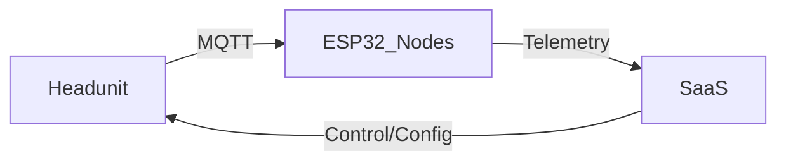

# Архитектура модуля

## 📦 Назначение

Краткое описание роли репозитория в общей системе.

## ⚙️ Общая структура

(Диаграмма/описание ключевых компонентов)

## 🔗 Взаимодействие с другими компонентами

- cd-headunit — инфраструктура (сеть/MQTT/OTA)
- cd-esp — узлы IoT (помпа, клапаны, бойлер и т.д.)
- cd-saas — облако (API, OTA, телеметрия, UI)
- cd-schemas — схемы данных/контракты
- cd-factory-tools — производство/сервис

## 🔒 Безопасность

Ключевые аспекты (OTA, подписи, mTLS, изоляция конфигов).

## 🧠 Примечания

Держим диаграммы актуальными. Используем Mermaid/Draw.io/PlantUML.
